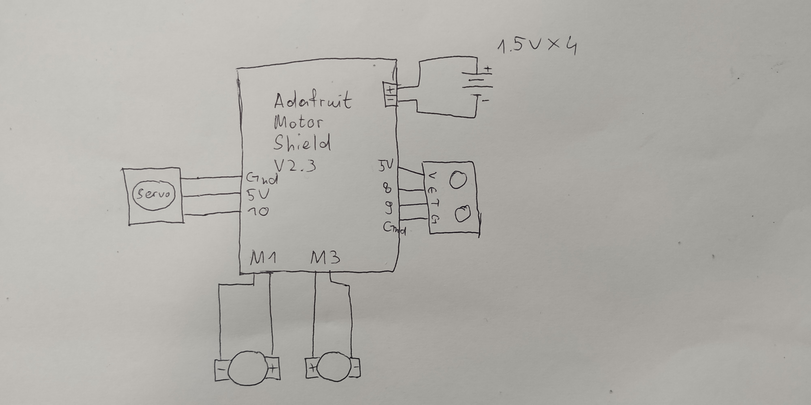
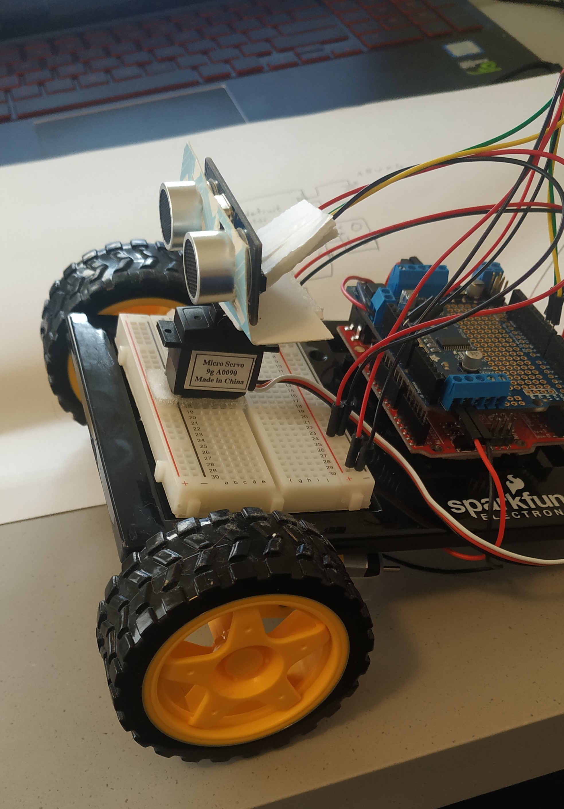
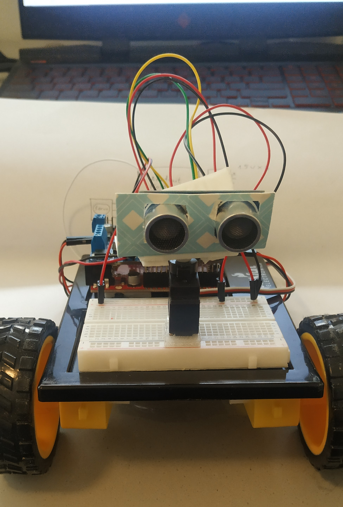
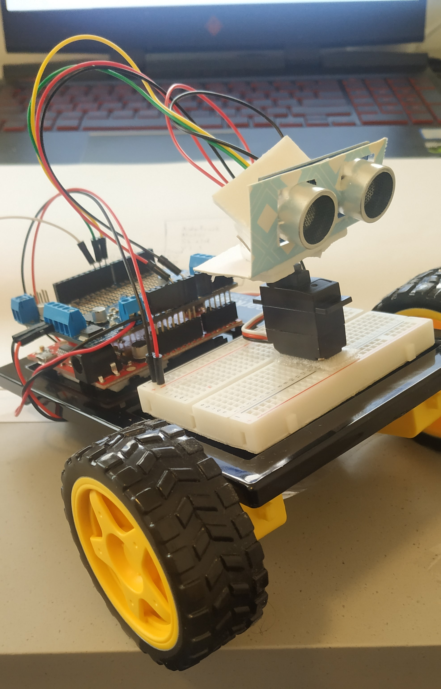

# Final Project 

## Idea
For my final project I built an autonomous robot that moves around a space and avoids obstacles.

## Components
Redboard
Breadboard
Jumper wires
Both DC motors
Both wheels
Distance measuring sensor
Battery holder
Servo motor
Adafruit V2.3 motor shield

## How it works
A sonar mounted on top of a servo is measuring the distance in front of the robot. The sensor is attached to the servo because the servo is rotating it 20 degrees in both directioons in small time intervals, to give it a larger field of view. If there is an object in front of the robot within 30cm, the car stops, retreats and moves either left or right depening on the relative position of the object. If all else is normal, the car keeps moving forward. The robot is moved by two DC motors, and the entire circuit is controlled by an arduino. (The details are explained in the code using comments).

## Schematic

## Images

## VIdeo
### The link to the video can be found [here](https://drive.google.com/drive/folders/1qWg_s_vuB8lO4eAikoYo8YRJCsLUn7fA?usp=sharing).

