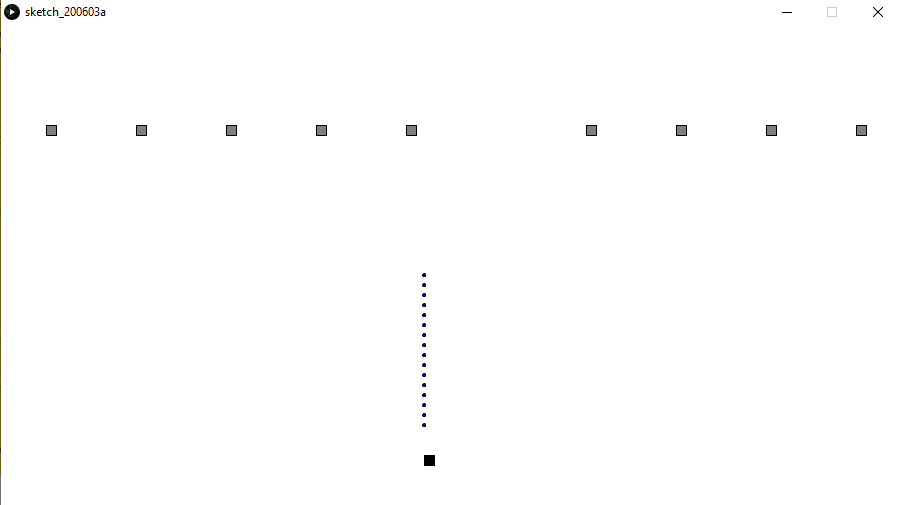

## A Simple Target Shooting Game
### What is my project?
For this assignment I used OOP in Java to create a simple game in which the player is able to shoot at 10 different static targets with 100 bullets.
The classes which I created for the player, bullets, and enemies are all in different tabs. The bodies of the objects are primitive processing shapes such as rectangles and circles.
#### The code is explained in detail with comments next to the lines.

### Difficulties
While making this code, I ran into multiple difficulties, especially with the arrays and the null pointer exception. Since I am a beginner at OOP,
I spent quite a lot of time understanding how to move information back and forth between the classes and the main body of the code. Additionaly, what I was not able to do was
to give the player lives, and enemy bullets, however, I will come back to this problem in the future and make this game a bit more complex.

### Screenshot of the game

