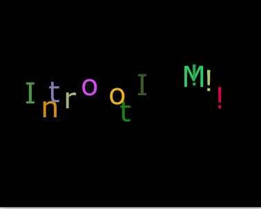

## Shaky Text

This is a very simple code which I wrote to practice the implementation of text in processing. The pre-determined sentence is divided into each
character. The characters are placed at an even distance accros the screen. When the player interacts with the program, the text begins to uncontrolably shake
and each letter begins to chane color giving the impression of excitement.

How to interact with the program?
You can interact with the program simply by pressing and holding the left mouse button over the screen. If you wish to stop the shaking, release the mouse button, and the
movement will immediately stop.

### Image:

## Transformation

For the transformation excercise, I tried to find a way to make one part of my homework 2 look slightly better. After learning learning the syntax and logic behind transformation in processing, I discovered that it is possible to rotate the entire background, which was made of a large number of small rectangles. Even at a large number, only with a couple of lines of code I was able to mirror the thousands of background rectangles.
