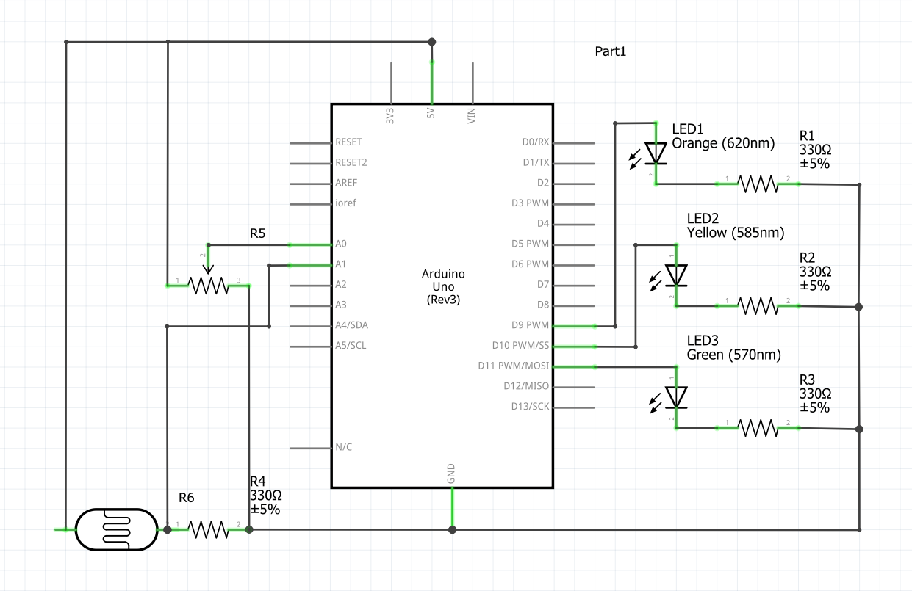

## Traffic Light

### Description
Three LEDs are controlled by a potentiometer and a photo resistor. Depending on the value of the potentiometer only one of the LEDs glows
(red, yellow, green). If the environment is too dark, all three LEDs glow at the same time.

### How it works
By reading the value of the potentiometer in the analog pin A0, the board recieves a value from 0 to 1023. If the value of the potentiometer is less than 340, an if statement in the code gives command for the green LED to glow by assigning an analog value of 255 to the digital pin 9, if the value is between 340 and 680, the yellow one glows attached to pin 10 in the same way as the green LED, and if the value is above 680, the red LED glows whcih is attached to pin 11. I chose the number 340 as a step because it is aprroximately 1/3 of 1023.
Finally an if statement checks if the value of the photo resistor which is assinged to analog pin A1 is below a certain treshold, and if the staement is true, it assigns a digital value of high to the pins 9, 10, and 11 to which the LEDs are attached

### Scheme

