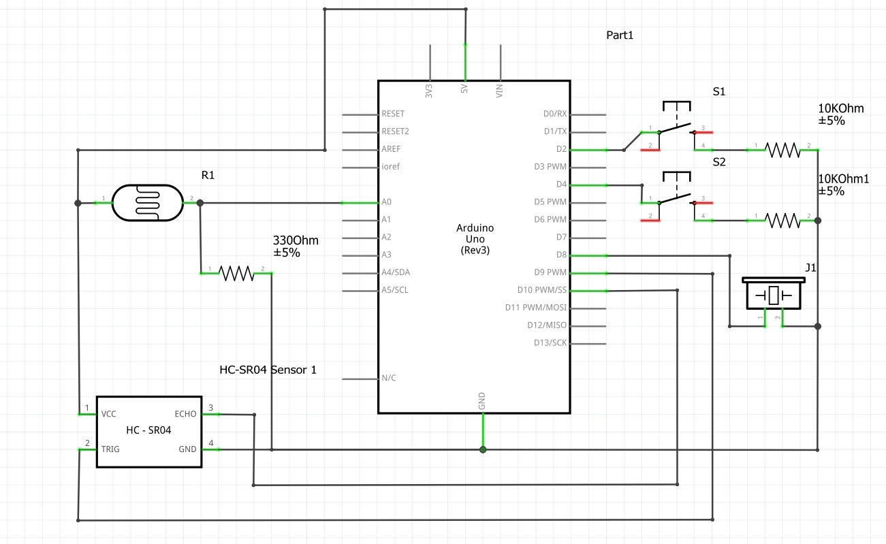

## Introduction
This musical instrumeent is a hybrid between a 1 string instrument and a simple keyboard. You are able to play any music which consists of
the seven basic notes + 1 C in the next octave.

## How does it work
An ultra-sonic sensor detects the distance between the sensor itself and an object in front of it. Using this, I have separated straight space of 
35cm into 8 segments. If an object is found in one of those 8 segments, the ultra-sonic sensor detects its distance. Based on that distance, 
it calculates in which segment the object is placed and therfore sends a signal to the board. When the red push button is pressed, it gives a signal to the 
buzzer to play a note, based on the segment in which the object is found. Using this concept, a person can play anything as long as they are placing something
into the segments and pressing the button at the same time. One important feature disables the use of the device in dark environments. This is to 
prevent individuals to use it to annoy others at night. However, this too has a bypass mechanism, which I leave to the users to discover.
Note that if multiple objects are placed in the path of the sensor, only the closest one will be detected.

## Circuit

### Images of the project

### Video examples of the project can be found [here](https://drive.google.com/drive/folders/1jUeDIOQ7f7T1-iuyaIUewAOa-nflh8SY?usp=sharing).
Please use your NYU email addres to access the videos.

## Difficulties
A bigger portion of the main code is hard-coded. I had trouble making a class for the tone playing part of the code, but I am working to improve
this code in the future.
