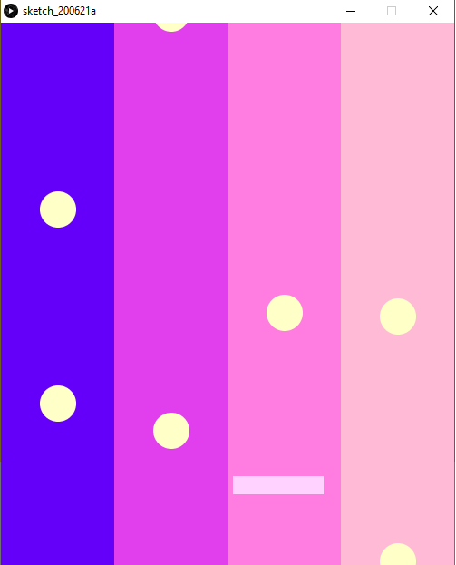
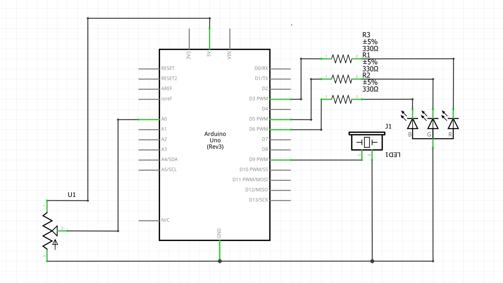

### Introduction

For this project I created a simple game which is controlled, and interacts with an arduino. The game contains four columns of different colors. Near the bottom of the screen, the player is represented by a long, but thin horizontal rectangle. The game is not competitive, but the goal is to hit the circles which are droping from above. You control the player simply by rotating a potentiometer. Whenever a circle is "collected" or hit, depending on which column it is located in, it will generate a certain sound. The sound however, is played by the controller circuit. This sound is acompanied by an RGB LED lighting up in a specific color. 

### How it works

The Arduino and Processing are communicating through the laptop's serial ports. They commmunicate both ways, and have both inputs and outputs. The details of communication between the two codes (and two programs) are explained as comments in the code.

### Image

### Video
####PThe link to the video can be found here.
Please note that you must use your NYU email to access the videos.

### Scheme

### Difficulties
Initially, I wanted to controll the player using an ultrasonic distance measuring sensor. However, I realized that it is too imprecise, and that it will cause disturbances while moving the rectangle.
