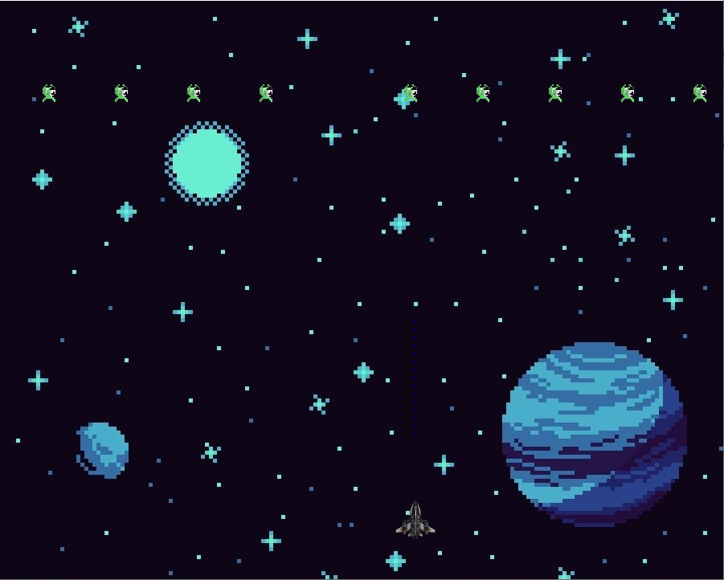

## Image loading into the game.

This is an updated version of the space shooter game. I used images to make the game more immersive.
The goal of this excercise was to load the images into the code successfully without disturbig the code itself.
How to use the program?
Use the A and D keys to move left and right, and the W key to shoot. Aim at the green aliens above the space ship.
Be careful! You only have 100 bullets to kill the enemies. You win by killing all enemies before you run out of bullets.

